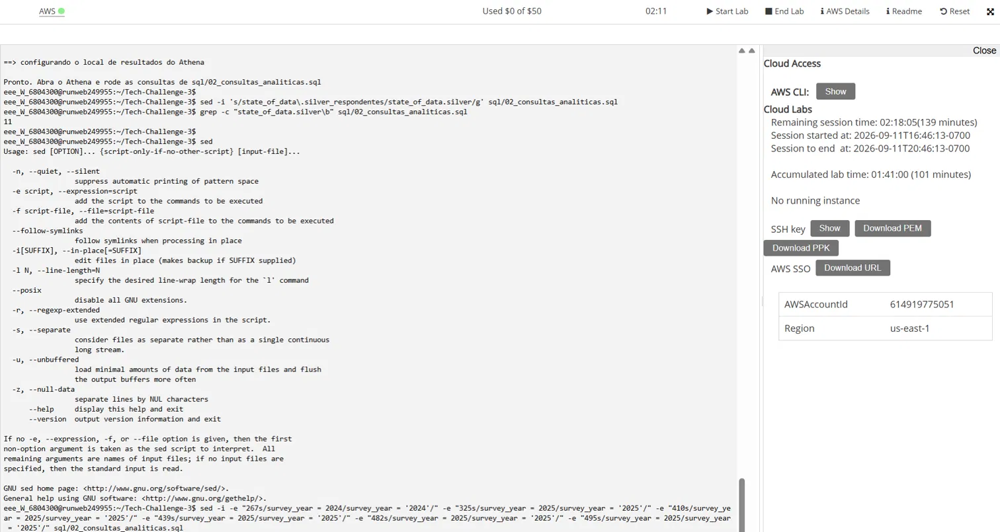
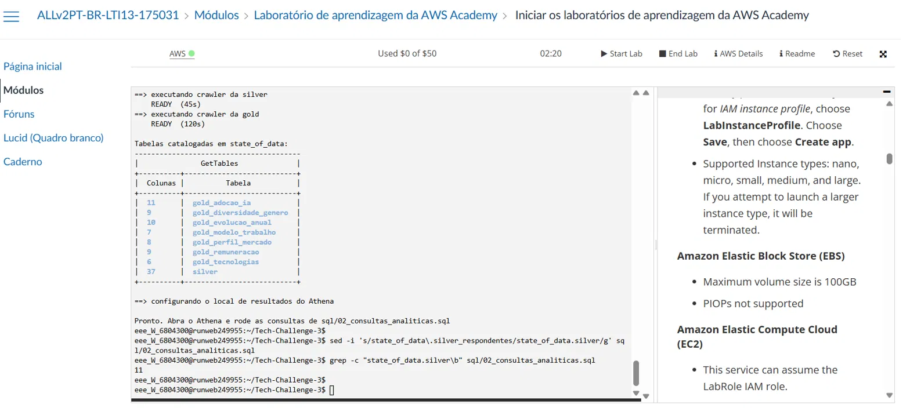
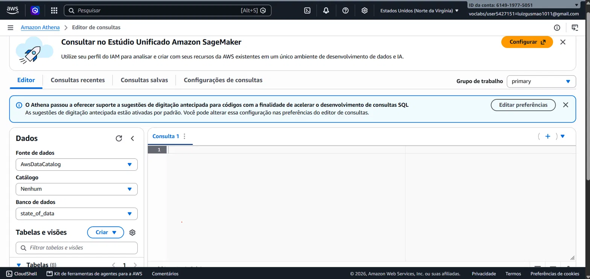
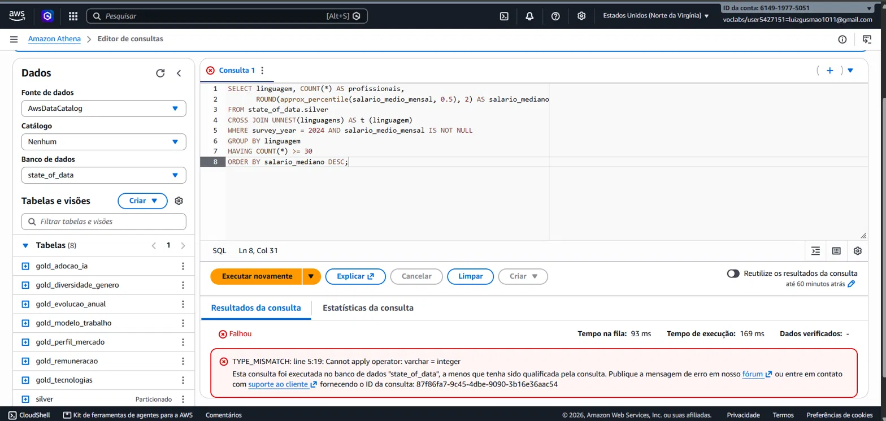
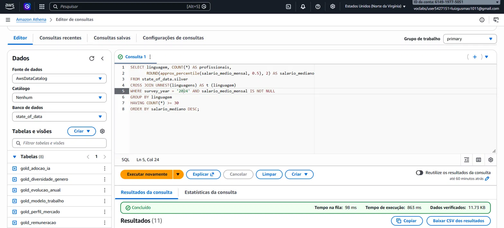
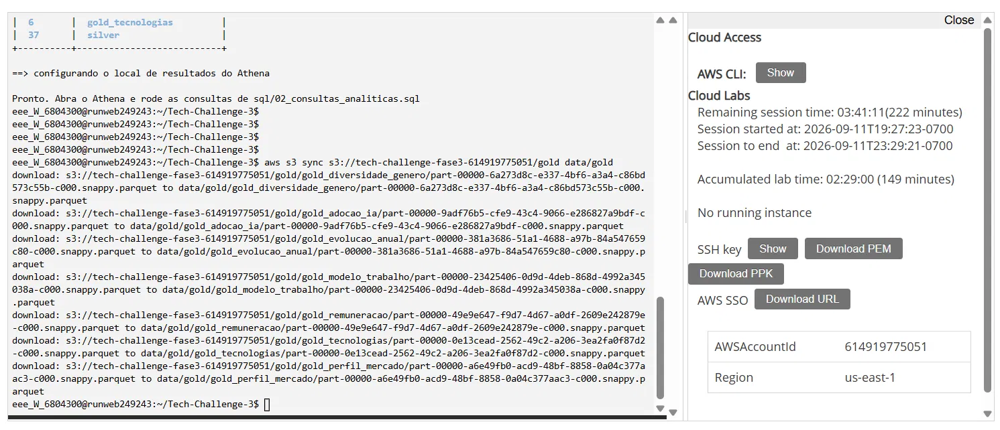

# Evidência de execução na AWS Academy Lab

Registro da execução real do pipeline no AWS Academy Lab, complementando os
scripts de `scripts/`. Três execuções completas — as duas primeiras em contas
AWS Academy Lab diferentes (cada aluno tem a sua — não dá pra continuar de
onde o outro parou), a terceira reexecutando tudo na mesma conta da Execução
2 para reverificar o pipeline depois da correção do diagrama de arquitetura:

| | Execução 1 (histórica) | Execução 2 | Execução 3 (atual) |
|---|---|---|---|
| Conta AWS | `614919775051` | `147320489456` | `147320489456` |
| Região | `us-east-1` | `us-east-1` | `us-east-1` |
| Tabelas Gold | 7 | 9 | **9** |
| Consultas Athena verificadas | 2 de 28 (por print) | 28 de 28 (via CLI) | **28 de 28** (via CLI) |

## Execução 3 — atual (reverificação pós-correção do diagrama)

Depois de corrigir a renderização do diagrama de arquitetura (ver
`architecture/arquitetura_aws.drawio`), o pipeline inteiro foi rodado de novo
do zero na mesma conta da Execução 2, para confirmar que nada quebrou:

**1. Glue Jobs — 3 jobs, run IDs novos, mesmo bucket:**

| Job | Run ID | Status | Duração |
|---|---|---|---|
| `tc3-job-bronze` | `jr_d2e08f856b54fced084bbab87aad774c51bd421276881d91d78e89da56a649c4` | SUCCEEDED | 89s |
| `tc3-job-silver` | `jr_ffc092b28a031c1c2646dba15971917bf92c7d78eab115f6d525b02c294bc490` | SUCCEEDED | 73s |
| `tc3-job-gold`   | `jr_9cb7fce981ffc71842d0171d0c3ef8615252413844d896c31e8fe8a4ee654843` | SUCCEEDED | 73s |

Confirmado também ao vivo no console (painel "Job run monitoring", AWS Glue
Studio): últimos 7 dias, **6 execuções, 0 falhas, 100% de taxa de sucesso**
(as 3 desta execução mais as 3 da Execução 2, ainda dentro da janela).

**2. Crawlers — os 2 crawlers separados, ambos terminaram `Ready` com
`Succeeded`** na última execução (confirmado no console, aba Crawlers).

**3. Data Catalog — 10 tabelas** (9 Gold + Silver) confirmadas tanto via
`aws glue get-tables` quanto navegando ao vivo na aba "Data Catalog tables"
do console:

```
gold_adocao_ia              11 colunas
gold_diversidade_genero      9 colunas
gold_evolucao_anual         10 colunas
gold_impacto_ia              4 colunas
gold_modelo_trabalho         7 colunas
gold_perfil_mercado          8 colunas
gold_remuneracao             9 colunas
gold_remuneracao_regional    7 colunas
gold_tecnologias             6 colunas
silver                      37 colunas
```

**4. Athena — consulta 1.1 rodada ao vivo no Query Editor do console**
(login federado via `sts`/`signin.aws.amazon.com`, sem senha nem console
root — só as credenciais de sessão do próprio Academy Lab), confirmada
SUCCEEDED com as 3 linhas esperadas (uma por edição da pesquisa).

**5. As 28 consultas de `sql/02_consultas_analiticas.sql`, via CLI**
(`python3 scripts/05_verificar_athena.py`, script novo neste commit — reduz
a verificação a um único comando reproduzível, em vez de comandos avulsos):
**28/28 SUCCEEDED, 0 falhas.** Lista completa dos Query Execution IDs em
[`athena_execucao_atual.md`](athena_execucao_atual.md).

> Esta execução não tem capturas de tela novas (só a Execução 1, abaixo,
> tem) — a verificação foi feita ao vivo no console e via CLI, com os run
> IDs e Query Execution IDs acima como registro. Repetir com prints é
> possível a qualquer momento com uma sessão nova do Academy Lab.

## Execução 2 — anterior (9 tabelas, 28/28 consultas confirmadas via CLI)

Depois da execução histórica (seção abaixo), o pipeline ganhou 2 tabelas
novas — `gold_impacto_ia` e `gold_remuneracao_regional` — para cobrir dois
pontos de revisão: o impacto da IA generativa nas empresas (o enunciado pede
isso explicitamente, e só havia adoção), e a comparação regional controlada
por senioridade (a versão bruta misturava composição de carreira com
diferença regional). Essa segunda execução, numa conta AWS Academy Lab
diferente (a do autor principal do repositório), confirma que as correções
funcionam de ponta a ponta, não só localmente:

**Glue Jobs — 3 jobs, run IDs reais:**

| Job | Run ID | Status | Duração |
|---|---|---|---|
| `tc3-job-bronze` | `jr_208106fb9e2bf41daceb874211b978a24be4eaa248da0507e6bfcdc50cd8e29d` | SUCCEEDED | 100s |
| `tc3-job-silver` | `jr_23699d1f864f8511513dfa78adc28c39f657e32f33a6fb4e311d85b7283b0b7f` | SUCCEEDED | 100s |
| `tc3-job-gold`   | `jr_d8296079e6bbfc934e23d7416a3793a44e57958d79ce8707d09e9c9df1ea7c99` | SUCCEEDED | 71s |

Data Lake: **bronze 3 objetos · silver 12 objetos · gold 9 objetos** (as 2
tabelas novas incluídas, confirmando que o job_gold atualizado roda sem erro
no runtime real do Glue 5.0, não só no ambiente local que o espelha).

**Crawler — 10 tabelas catalogadas** (2 crawlers separados, Silver e Gold,
como corrigido — ver arquitetura):

```
gold_adocao_ia              11 colunas
gold_diversidade_genero      9 colunas
gold_evolucao_anual         10 colunas
gold_impacto_ia              4 colunas   <- nova
gold_modelo_trabalho         7 colunas
gold_perfil_mercado          8 colunas
gold_remuneracao             9 colunas
gold_remuneracao_regional    7 colunas   <- nova
gold_tecnologias             6 colunas
silver                      37 colunas
```

**Athena — as 28 consultas de `sql/02_consultas_analiticas.sql`, todas
executadas via `aws athena start-query-execution` (não simulação local) —
28 SUCCEEDED, 0 falhas.** Isso inclui a consulta 4.3, a única com sintaxe
exclusiva do Trino (`CROSS JOIN UNNEST`) que só tinha sido validada via
tradução para Spark até este ponto — agora confirmada rodando no Trino de
verdade.

**Reprodutibilidade cruzada:** a tabela `gold_impacto_ia` gerada nesta
execução na AWS foi sincronizada de volta (`aws s3 sync`) e comparada
byte-a-byte com a mesma tabela gerada localmente — **idêntica**. Mesmo
código, mesmos dados, mesmo resultado, rodando no Glue 5.0 gerenciado da AWS
e no ambiente local que o espelha (Spark 3.5.1 + Python 3.11 + Java 17).

## Execução 1 — histórica (7 tabelas, a origem dos prints abaixo)

## 1. Glue Jobs — os 3 jobs concluídos com sucesso

`bash scripts/03_executar_pipeline.sh` disparou os três jobs em sequência,
cada um aguardando o anterior terminar (Silver depende do Bronze pronto):

| Job | Run ID | Status | Duração |
|---|---|---|---|
| `tc3-job-bronze` | `jr_a442d29ae4e41947b21387790f7ba8afa8a1d631aab19998ebc64d8830ee742b` | SUCCEEDED | 111s |
| `tc3-job-silver` | `jr_49f35e62446e550416eb27095deae0dd7c5c1653e34a7fbac4229dcac93ee290` | SUCCEEDED | 102s |
| `tc3-job-gold`   | `jr_8eddbf2dde276d10d70a73c244d7476f537af1535ac4077f34d6ff434476f53a` | SUCCEEDED | 107s |

Data Lake resultante: **bronze 3 objetos · silver 12 objetos · gold 7 objetos**.



## 2. Glue Crawler + Data Catalog — 8 tabelas catalogadas

`bash scripts/04_criar_crawler.sh` roda dois crawlers separados (Silver e
Gold — ver nota abaixo) e lista o resultado via `aws glue get-tables`:

| Tabela | Colunas |
|---|---|
| `silver` | 37 |
| `gold_adocao_ia` | 11 |
| `gold_diversidade_genero` | 9 |
| `gold_evolucao_anual` | 10 |
| `gold_modelo_trabalho` | 7 |
| `gold_perfil_mercado` | 8 |
| `gold_remuneracao` | 9 |
| `gold_tecnologias` | 6 |



> **Nota:** a primeira versão do script usava um único crawler apontando para
> Silver e Gold ao mesmo tempo, com a configuração `TableLevelConfiguration`
> pensada para o Gold (que tem várias subpastas, uma por tabela). Aplicada
> também à Silver — uma única tabela particionada por `survey_year` — isso
> quebrava a Silver em tabelas fantasma (`survey_year_2023`,
> `survey_year_2024`, `survey_year_2025`). O script atual usa um crawler para
> cada camada, com a configuração certa para cada uma, e remove essas tabelas
> fantasma se existirem.

## 3. Amazon Athena — console, tabelas e consulta executada

Console real do Athena, banco `state_of_data`, as 8 tabelas do Data Catalog
visíveis no painel:



A consulta 4.3 (`sql/02_consultas_analiticas.sql`) primeiro **falhou**:

```
TYPE_MISMATCH: line 5:19: Cannot apply operator: varchar = integer
```

Isso confirma algo que só se descobre rodando de verdade: o Glue Crawler
tipou a partição `survey_year` da tabela `silver` como `varchar`, não como
`int` (comportamento conhecido do Crawler com partições inferidas do
caminho). As consultas foram ajustadas para comparar `survey_year` com
literal em aspas (`'2024'`, não `2024`).



Após o ajuste, a mesma consulta rodou com sucesso:



## 4. Sincronização S3 → local (verificação do conteúdo do Data Lake)

`aws s3 sync` trazendo as 7 tabelas Gold de volta para conferência local —
confirma que os arquivos Parquet gerados pelos Glue Jobs realmente existem
no bucket, nos prefixos esperados (`raw/`, `bronze/`, `silver/`, `gold/`):



## Como isso se conecta com o código deste repositório

Todo o texto acima documenta uma execução real; os scripts que a produzem
estão em `scripts/00_configurar.sh` a `scripts/04_criar_crawler.sh`, e o SQL
em `sql/`. Rodar de novo, do zero, com uma sessão nova do Academy Lab:

```bash
source scripts/00_configurar.sh
bash scripts/01_provisionar.sh
bash scripts/02_criar_jobs.sh
bash scripts/03_executar_pipeline.sh
bash scripts/04_criar_crawler.sh
```

As credenciais do Academy Lab são por conta — cada execução nova precisa
provisionar o bucket do zero (ver `README.md`).
